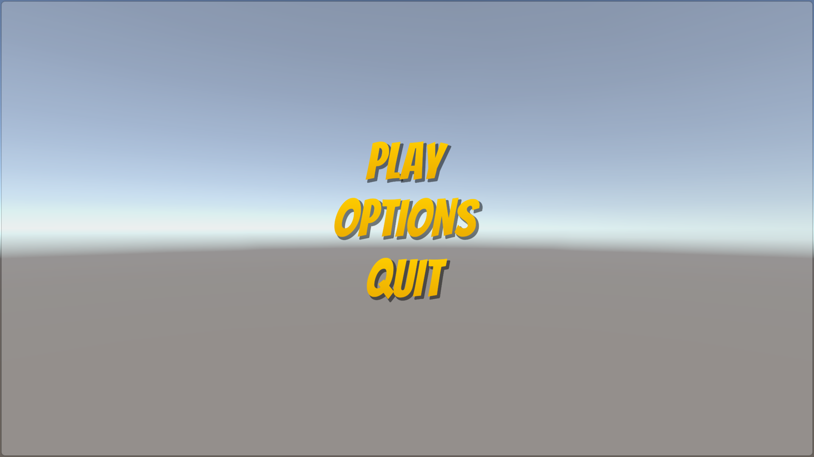
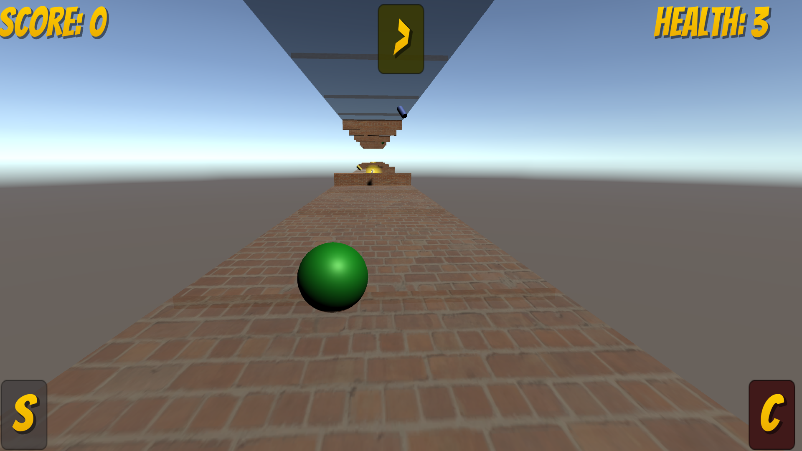
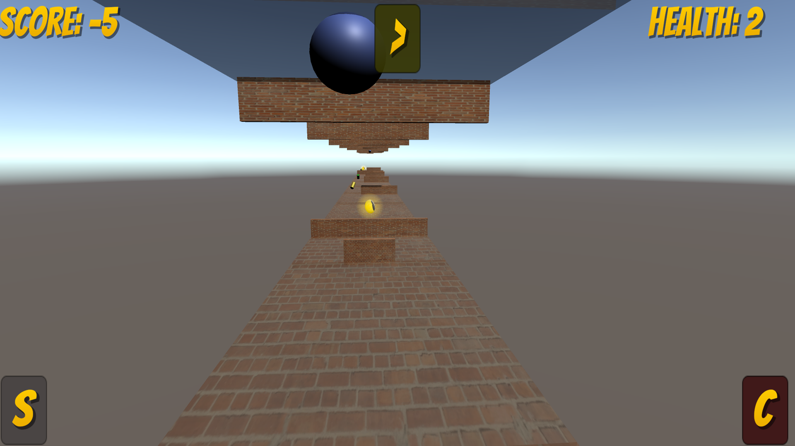

 
## To play :
In this game you shall to concentrate to win, The goal is to collect score points as many as you can. 
When you are on the bottom lane, you are shall collect only the score points which have the same color as the ball. If you did not you will be punished by taking  5 points from you. But if you succeeded you will awarded 10 points. 
On the upper lane it is reversable you will be punished if you collect the same color but awarded if you collect any other color. 
the color of the ball changes randomly every 15 seconds.
Here is some controllers to use along the game:
1)Use (A,D) or (<- , ->)to move left and right.
2)Press space to switch between platforms. 
3)Press (C) to switch between Cameras.
If You are on mobile:
1)Tilt your mobile to go right/left
2)press on the (S) Button to switch between platforms
3)press on the (C) button to switch between cameras
4)press on (>) button to pause the game

